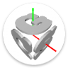
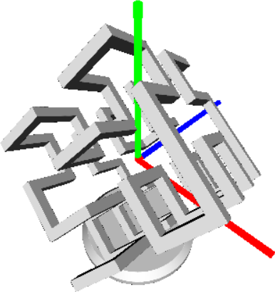
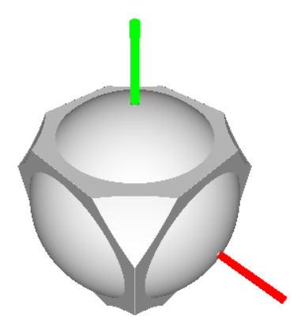
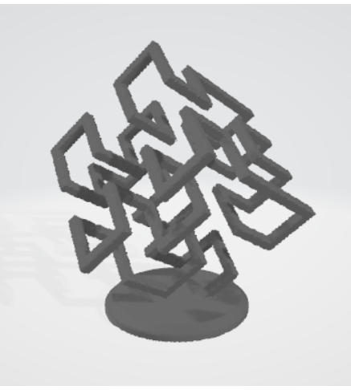

#  **DesignCSG**

*The #1 Application for Constructive Solid Geometric Design*

## Features
* Design 3D objects using signed distances fields and OpenCL.
* Create hierarchical designs using Python.
* Export designs to .stl and .ply files with varying levels of detail.

## Design Examples

 

## Export Examples

 

## Software Requirements
* Windows 10 or 11
  
## Hardware Requirements
* OpenCL compatible graphics processor. NVidia Geforece GTX or RTX recommended. 
* At least 8GB ram
  
## Usage
* Clone the repo and run the program using `master/run.bat`.
  * If you get a dll error, run `master/copydlls.bat`.
* At any time, you can download the latest updates using `git pull`.
* Open the example code with `file -> open -> Design1.py` or `file -> open -> Design2.py` , and visualize your design using `file -> run`. Use the API reference to modify the code to your liking.
* Save your design with `file -> save`.
* View your changes by selecting `file -> run`.
* When you are ready, export your design using `file -> export`. Most medium resolution exports can be completed in less than half an hour.
* You can create a new design with `file -> new`, or open an existing one with `file -> open`.
  
## API Reference
* Under construction.
  
## License
* All original code is release under the MIT license. See LICENSE.md.
  
## Atributions
happly -- https://github.com/nmwsharp/happly/blob/master/LICENSE -- MIT License
Python 310 + Various PIP Packages
Intel OpenCL SDK
Stack Overflow Posts -- https://creativecommons.org/licenses/by-sa/4.0/ -- CC-By-SA 4.0
Microsoft Windows API Documentation

