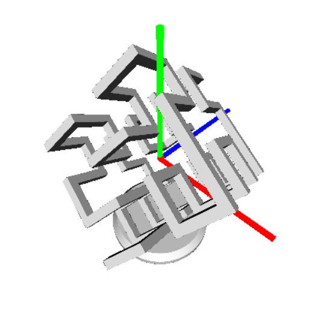
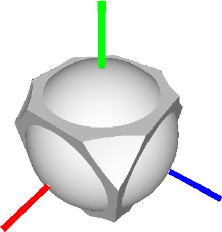
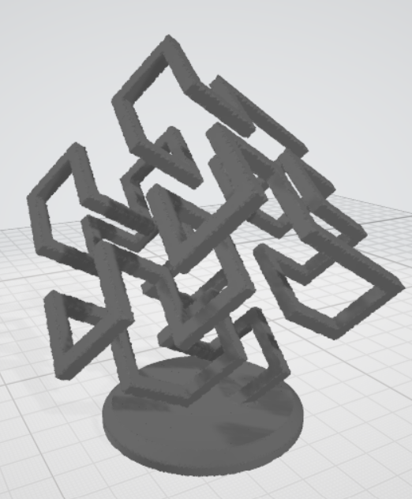
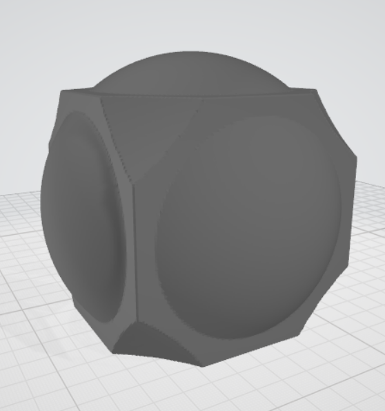

# DesignCSG

*The #1 application for constructive solid geometry design*

## Features
* Design 3D objects using signed distances fields and OpenCL.
* Create hierarchical designs using Python.
* Export designs to .stl and .ply files with varying levels of detail.

## Design Examples
* 3D Hilbert Curve
  

* Abstract Geometry
  

## Export Examples

* Abstract Geometry
  

## Software Requirements
* Windows 10 or 11
## Hardware Requirements
* OpenCL compatible graphics processor. NVidia Geforece GTX or RTX recommended. 
* At least 8GB ram
## Usage
* Download and run the installer from *todo*.
* Open the program and read through the example code
* Use the API documentation to modify the code to your liking
* Save your design with `file -> save`
* View your changes by selecting `file -> run`
* When you are ready, export your design using `file -> export`.
    * *At this time, exporting may take several hours. Active work is being done to optimize the export algorithm.*
## API Reference
* Todo.
## License
* All original code is copyright Michael Sohnen 2021. Official licenses are still in development.
